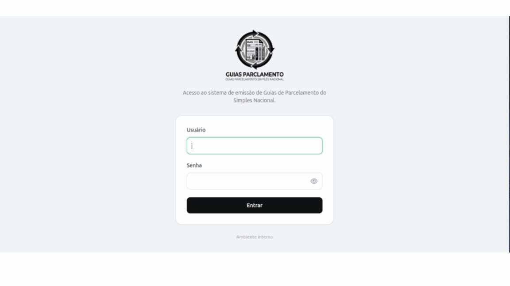

# Serpro Parcelamento

Sistema web desenvolvido em Python (Flask) para automação fiscal e contábil, focado na emissão, recálculo e consulta de guias DAS (Parcelamento Simples Nacional e MEI) com integração direta à API Integra Contador do SERPRO e ao banco de dados da Domínio Sistemas.

## Principais Funcionalidades

* **Integração SERPRO:** Comunicação com a API Integra Contador utilizando autenticação mTLS e assinatura de termos de procurador.
* **Emissão em Lote:** Geração de guias DAS em lote através de upload de planilhas Excel (`.xlsx`).
* **Integração Domínio:** Consulta automatizada (via CNPJ) ao banco de dados Sybase (SQL Anywhere) da Domínio Sistemas.
* **Gestão de Certificados:** Painel administrativo para upload e gerenciamento seguro de certificados digitais (`.pfx`, `.p12`).
* **Auditoria e Segurança:** Registro completo de ações de usuários (logins, emissões, uploads) e controle de acesso baseado em perfis (Admin/User).

---
## <svg xmlns="http://www.w3.org/2000/svg" width="24" height="24" viewBox="0 0 24 24" fill="none" stroke="currentColor" stroke-width="2" stroke-linecap="round" stroke-linejoin="round" class="lucide lucide-monitor-play preview-icon"><path d="M15.033 9.44a.647.647 0 0 1 0 1.12l-4.065 2.352a.645.645 0 0 1-.968-.56V7.648a.645.645 0 0 1 .967-.56z"/><path d="M12 17v4"/><path d="M8 21h8"/><rect x="2" y="3" width="20" height="14" rx="2"/></svg> Demonstração (GIF)

<p align="center">
  
</p>

---

## <svg xmlns="http://www.w3.org/2000/svg" width="24" height="24" viewBox="0 0 24 24" fill="none" stroke="currentColor" stroke-width="2" stroke-linecap="round" stroke-linejoin="round" class="lucide lucide-triangle-alert preview-icon"><path d="m21.73 18-8-14a2 2 0 0 0-3.48 0l-8 14A2 2 0 0 0 4 21h16a2 2 0 0 0 1.73-3"/><path d="M12 9v4"/><path d="M12 17h.01"/></svg> Pré-requisitos Importantes

Antes de executar o projeto, certifique-se de ter instalado em seu ambiente:

1. **Python 3.8+**
2. **PostgreSQL (IMPORTANTE):** O sistema utiliza o PostgreSQL como banco de dados principal para armazenar usuários, logs de auditoria, histórico de requisições e metadados de certificados. **É obrigatório instalar e configurar um servidor PostgreSQL antes de iniciar a aplicação e criar o primeiro usuário.**
3. **SAP Sybase SQL Anywhere (Client/Drivers):** Necessário para que a biblioteca `sqlanydb` consiga se conectar ao banco de dados da Domínio Sistemas.

---

## <svg xmlns="http://www.w3.org/2000/svg" width="24" height="24" viewBox="0 0 24 24" fill="none" stroke="currentColor" stroke-width="2" stroke-linecap="round" stroke-linejoin="round" class="lucide lucide-shield-cog preview-icon"><path d="m10.929 14.467-.383.924"/><path d="M10.929 8.923 10.546 8"/><path d="M13.225 8.923 13.608 8"/><path d="m13.607 15.391-.382-.924"/><path d="m14.849 10.547.923-.383"/><path d="m14.849 12.843.923.383"/><path d="M20 13c0 5-3.5 7.5-7.66 8.95a1 1 0 0 1-.67-.01C7.5 20.5 4 18 4 13V6a1 1 0 0 1 1-1c2 0 4.5-1.2 6.24-2.72a1.17 1.17 0 0 1 1.52 0C14.51 3.81 17 5 19 5a1 1 0 0 1 1 1z"/><path d="m9.305 10.547-.923-.383"/><path d="m9.305 12.843-.923.383"/><circle cx="12.077" cy="11.695" r="3"/></svg> Instalação e Configuração

### 1. Clonar e preparar o ambiente
```bash
# Clone o repositório (ou acesse a pasta do projeto)
cd Serpro_Parcelamento

# Crie um ambiente virtual
python -m venv .venv

# Ative o ambiente virtual
# No Windows:
.venv\Scripts\activate
# No Linux/Mac:
source .venv/bin/activate

# Instale as dependências
pip install -r requirements.txt

```

### 2. Configurar Variáveis de Ambiente

Renomeie o arquivo `.env.example` para `.env` e preencha com as suas credenciais. Destaque para as configurações do banco:

```env
# Configurações do PostgreSQL
POSTGRES_HOST=localhost
POSTGRES_PORT=5432
POSTGRES_DB=nome_do_banco
POSTGRES_USER=seu_usuario_pg
POSTGRES_PASSWORD=sua_senha_pg

# Identificação / credenciais SERPRO
CNPJ_CONT=00000000000000
AUTOR_PEDIDO=00000000000000
CONSUMER_KEY=
CONSUMER_SECRET=

# Segurança
FLASK_SECRET_KEY=sua_chave_flask
CERTIFICATE_ENCRYPTION_KEY=sua_chave_fernet

# Armazenamento
CERTIFICATE_STORAGE_DIR=certificados_runtime
PDF_STORAGE_DIR=pdfs_runtime

# Banco Domínio
DOMINIO_HOST=
DOMINIO_PORT=2638
DOMINIO_DB=
DOMINIO_USER=
DOMINIO_PASSWORD=
...

```

### 3. Configurar os Certificados Digitais

Após iniciar o sistema e acessar uma conta com perfil de administrador, acesse **Administração > Certificados** para gerenciar os certificados utilizados pela aplicação:

* **Autenticação SERPRO (MTLS):** certificado utilizado para autenticar o contratante responsável pela chave de acesso à API Integra Contador.
* **Assinatura do procurador (AUTOR):** utilizada quando o CNPJ do contratante responsável pela chave SERPRO é diferente do CNPJ definido como Autor do Pedido de Dados. Nesse cenário, o sistema gera e assina o termo necessário para que o contratante realize as requisições em nome do autor.

Se o Contratante e o Autor do Pedido de Dados forem o mesmo CNPJ, o fluxo de procurador não é necessário e a aplicação realiza a requisição diretamente.

Os certificados podem ser enviados nos formatos `.pfx` ou `.p12` diretamente pela interface administrativa.
As senhas informadas no upload são armazenadas de forma criptografada utilizando a chave definida em `CERTIFICATE_ENCRYPTION_KEY`.
Quando um certificado precisar ser renovado, utilize a opção **Substituir** no painel administrativo. O certificado anterior será mantido no histórico.

### 4. Inicializar o Banco de Dados

Com o PostgreSQL rodando e o `.env` configurado, crie as tabelas executando o script de modelos:

```bash
python database/models.py

```

*(Nota: O primeiro usuário administrador deve ser inserido diretamente no banco de dados ou via script de seed inicial, garantindo o hash correto da senha e a role `ADMIN`).*


* Com a sua .venv ativada, rode o comando abaixo em uma única linha no terminal para criar o seu acesso inicial (substitua SuaSenhaForte123 pela senha desejada):
```
python -c "from database.models import Usuario, ROLE_ADMIN, session; admin = Usuario(username='admin', nome='Administrador', role=ROLE_ADMIN, ativo=True, trocar_senha_proximo_login=False); admin.set_password('SuaSenhaForte123'); session.add(admin); session.commit()"
```

### 5. Executar a Aplicação

Você pode iniciar a aplicação executando o arquivo principal:

```bash
python app.py

```

---

## <svg xmlns="http://www.w3.org/2000/svg" width="24" height="24" viewBox="0 0 24 24" fill="none" stroke="currentColor" stroke-width="2" stroke-linecap="round" stroke-linejoin="round" class="lucide lucide-folder-tree preview-icon"><path d="M20 10a1 1 0 0 0 1-1V6a1 1 0 0 0-1-1h-2.5a1 1 0 0 1-.8-.4l-.9-1.2A1 1 0 0 0 15 3h-2a1 1 0 0 0-1 1v5a1 1 0 0 0 1 1Z"/><path d="M20 21a1 1 0 0 0 1-1v-3a1 1 0 0 0-1-1h-2.9a1 1 0 0 1-.88-.55l-.42-.85a1 1 0 0 0-.92-.6H13a1 1 0 0 0-1 1v5a1 1 0 0 0 1 1Z"/><path d="M3 5a2 2 0 0 0 2 2h3"/><path d="M3 3v13a2 2 0 0 0 2 2h3"/></svg>  Estrutura do Projeto

Abaixo está a organização de pastas e arquivos do sistema:

```text
Serpro_Parcelamento/
├── .venv/                     # Ambiente virtual Python
├── auth/                      # Módulo de Autenticação e Segurança
│   ├── certificados_runtime/  # Armazenamento local temporário/seguro de certificados
│   ├── __init__.py
│   ├── audit_service.py       # Serviço de logs de auditoria
│   ├── auth_utils.py          # Decorators e helpers de login
│   └── certificate_service.py # Lógica de upload, extração e criptografia de certificados
├── database/                  # Módulo de Dados e Modelagem
│   ├── __init__.py
│   ├── banco_dominio.py       # Integração com banco Sybase da Domínio
│   └── models.py              # Modelos do SQLAlchemy (Postgres)
├── postgres_data/             # (Opcional) Volume de dados do PostgreSQL local
├── postgres_logs/             # (Opcional) Logs do PostgreSQL local
├── routes/                    # Controladores (Blueprints)
│   ├── __init__.py
│   ├── admin_routes.py        # Rotas do painel administrativo
│   ├── auth_routes.py         # Rotas de login e logout
│   ├── main_routes.py         # Rotas das páginas principais
│   └── requisicao_routes.py   # Rotas de geração de DAS e processamento em lote
├── static/                    # Arquivos estáticos
│   ├── css/
│   │   └── app.css            # Estilos da aplicação (Tailwind customizado)
│   └── images/                # Logos e ícones
├── templates/                 # Views (HTML/Jinja2)
│   ├── admin.html
│   ├── alterar_senha.html
│   ├── base.html
│   ├── consulta.html
│   ├── index.html
│   └── login.html
├── utils_serpro/              # Serviços de integração com a API do Governo
│   ├── __init__.py
│   ├── serpro_auth.py         # Autenticação e obtenção de token mTLS
│   ├── termo_procurador.py    # Geração e assinatura do XML de procuração
│   └── utils.py               # Helpers de formatação e envio de requests
├── .env                       # Variáveis de ambiente (não versionado)
├── .env.example               # Exemplo de variáveis de ambiente
├── .gitignore                 # Arquivos ignorados pelo Git
├── app.py                     # Entrypoint da aplicação Flask
├── iniciar_parcelamento.bat   # Script batch para inicialização no Windows
├── iniciar_parcelamento.vbs   # Script VBS para inicialização oculta no Windows
├── README.md                  # Este arquivo
└── requirements.txt           # Dependências do projeto (pip)

```

---

## <svg xmlns="http://www.w3.org/2000/svg" width="24" height="24" viewBox="0 0 24 24" fill="none" stroke="currentColor" stroke-width="2" stroke-linecap="round" stroke-linejoin="round" class="lucide lucide-copyright preview-icon"><circle cx="12" cy="12" r="10"/><path d="M14.83 14.83a4 4 0 1 1 0-5.66"/></svg> <svg xmlns="http://www.w3.org/2000/svg" width="24" height="24" viewBox="0 0 24 24" fill="none" stroke="currentColor" stroke-width="2" stroke-linecap="round" stroke-linejoin="round" class="lucide lucide-scale preview-icon"><path d="M12 3v18"/><path d="m19 8 3 8a5 5 0 0 1-6 0zV7"/><path d="M3 7h1a17 17 0 0 0 8-2 17 17 0 0 0 8 2h1"/><path d="m5 8 3 8a5 5 0 0 1-6 0zV7"/><path d="M7 21h10"/></svg> Licença e Uso

**Todos os Direitos Reservados.**

Este código-fonte é propriedade intelectual fechada e privada. É estritamente **proibido** copiar, distribuir, modificar, compilar ou utilizar este software (no todo ou em parte) para qualquer finalidade, comercial ou não comercial, sem a autorização expressa e por escrito dos desenvolvedores e/ou proprietários legais do sistema.

O uso não autorizado está sujeito às penalidades legais cabíveis.


